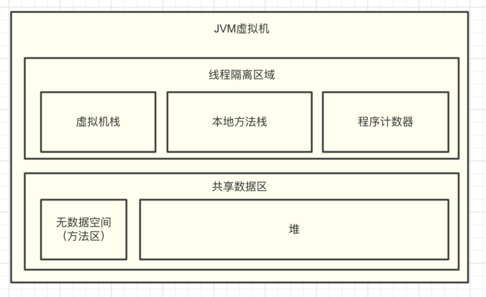
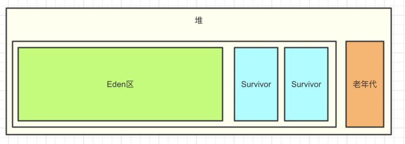
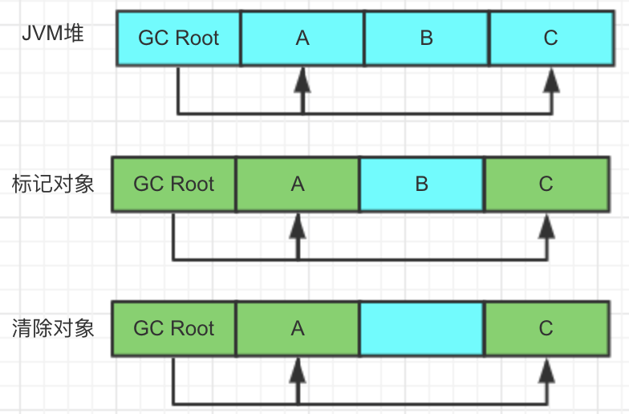

[TOC]

# JAVA

## 基础

### JAVA类加载器

#### JAVA类加载器包括几种？

1. 引导类加载器 bootstrap class loader

   启动类加载器主要加载的是JVM自身需要的类，这个类加载使用C++语言实现的，是虚拟机自身的一部分，它负责将 /lib路径下的核心类库或-Xbootclasspath参数指定的路径下的jar包加载到内存中，注意必由于虚拟机是按照文件名识别加载jar包的，如rt.jar，如果文件名不被虚拟机识别，即使把jar包丢到lib目录下也是没有作用的(出于安全考虑，Bootstrap启动类加载器只加载包名为java、javax、sun等开头的类

2. 扩展类加载器 ExtClassLoader

   它负责加载JAVA_HOME/lib/ext目录下或者由系统变量-Djava.ext.dir指定位路径中的类库，开发者可以直接使用标准扩展类加载器。

3. 应用程序类加载器 AppClassLoader

   应用程序加载器是指 Sun公司实现的sun.misc.Launcher$AppClassLoader。它负责加载系统类路径java -classpath或-D java.class.path 指定路径下的类库，也就是我们经常用到的classpath路径，开发者可以直接使用系统类加载器，一般情况下该类加载是程序中默认的类加载器，通过ClassLoader#getSystemClassLoader()方法可以获取到该类加载器。

#### 如何打破双亲委派模型？

- 自定义类加载器，继承ClassLoader类重写loadClass方法；

- SPI

### 类的加载过程？

1. **loading 加载**  
    通过双亲委派机制进行加载(加载指的是把class字节码文件从各个来源通过类加载器装载入内存中)。主要出于安全的考虑。父加载器不是加载器的加载器，也不是父类加载的加载器。  

2. **linking 链接**  

   - verification 验证  
     - **文件格式的验证**：比如常量中是否有不被支持的常量？文件中是否有不规范的或者附加的其他信息？
     - **元数据的验证**，比如该类是否继承了被final修饰的类？类中的字段，方法是否与父类冲突？是否出现了不合理的重载？
     - **字节码的验证**，保证程序语义的合理性，比如要保证类型转换的合理性。
     - **符号引用的验证**，比如校验符号引用中通过全限定名是否能够找到对应的类？校验符号引用中的访问性（private，public等）是否可被当前类访问？
   - preparation 准备 静态变量赋默认值，private static int test =10; 在这个阶段只是 test赋默认值0，而不是10。  
   - resolution 解析 将类、方法、属性等符号引用解析为直接引用。常量池中的各种符号引用解析为指针，偏移量等内存地址的直接引用。  举个例子来说，现在调用方法hello()，这个方法的地址是1234567，那么hello就是符号引用，1234567就是直接引用。

3. **initalizing 初始化**  

   主要是对**类变量**初始化，是执行类构造器的过程。换句话说，只对static修饰的变量或语句进行初始化。
   
   private static int test =10在这一步才会被赋值成test=10  

### SPI是什么(https://www.cnblogs.com/xrq730/p/11440174.html)

SPI全称Service Provider Interface，在Java中还是一个比较重要的概念，是Java提供的一套用来被第三方实现或者扩展的API，或者换句话说，**SPI是一种服务发现机制**。

​	要使用SPI比较简单，只需要按照以下几个步骤操作即可：

- 在jar包的META-INF/services目录下创建一个以"接口全限定名"为命名的文件，内容为实现类的全限定名
- 接口实现类所在的jar包在classpath下
- 主程序通过java.util.ServiceLoader动态状态实现模块，
- 它通过扫描META-INF/services目录下的配置文件找到实现类的全限定名，把类加载到JVM
- SPI的实现类必须带一个无参构造方法

## 集合

### HashMap1.7和1.8的区别

jdk1.8相对于1.7底层实现发生了一些改变。**1.8主要优化减少了Hash冲突 ，提高哈希表的存、取效率。**

1. 底层数据结构不一样，1.7是**数组+链表**，1.8则是**数组+链表+红黑树结构（当链表长度大于8，转为红黑树）。**
2. JDK1.8中resize()方法在表为空时，创建表；在表不为空时，扩容；而JDK1.7中resize()方法负责扩容，inflateTable()负责创建表。
3.  1.8中没有区分键为null的情况，而1.7版本中对于键为null的情况调用putForNullKey()方法。但是两个版本中如果键为null，那么调用hash()方法得到的都将是0，**所以键为null的元素都始终位于哈希表table【0】中。**
4. 当1.8中的桶中元素处于链表的情况，遍历的同时最后如果没有匹配的，直接将节点添加到链表尾部；而1.7在遍历的同时没有添加数据，而是另外调用了addEntry()方法，将节点添加到链表头部。
5. 1.7中新增节点采用头插法，1.8中新增节点采用尾插法。这也是为什么1.8不容易出现环型链表的原因。
6. 1.7中是通过更改hashSeed值修改节点的hash值从而达到rehash时的链表分散，而1.8中键的hash值不会改变，rehash时根据（hash&oldCap）==0将链表分散。
7.  1.8rehash时保证原链表的顺序，而1.7中rehash时有可能改变链表的顺序（头插法导致）。
8. **在扩容的时候：1.7在插入数据之前扩容，而1.8插入数据成功之后扩容。**

### 谈一下HashMap的特性？

1. HashMap存储键值对实现快速存取，允许为null。key值不可重复，若key值重复则覆盖。

2. 非同步，线程不安全。

3. 底层是hash表，不保证有序(比如插入的顺序)

### 谈一下HashMap的底层原理是什么？

基于hashing的原理，jdk8后采用数组+链表+红黑树的数据结构。我们通过put和get存储和获取对象。当我们给put()方法传递键和值时，先对键做一个hashCode()的计算来得到它在bucket数组中的位置来存储Entry对象。当获取对象时，通过get获取到bucket的位置，再通过键对象的equals()方法找到正确的键值对，然后在返回值对象。

### 谈一下hashMap中put是如何实现的？

1. 计算关于key的hashcode值（与Key.hashCode的高16位做异或运算）

2. 如果散列表为空时，调用resize()初始化散列表

3. 如果没有发生碰撞，直接添加元素到散列表中去

4. 如果发生了碰撞(hashCode值相同)，进行三种判断

     4.1. 若key地址相同或者equals后内容相同，则替换旧值

     4.2. 如果是红黑树结构，就调用树的插入方法

     4.3. 链表结构，循环遍历直到链表中某个节点为空，尾插法进行插入，插入之后判断链表个数是否到达变成红黑树的阙值8；也可以遍历到有节点与插入元素的哈希值和内容相同，进行覆盖。

5. 如果桶满了大于阀值，则resize进行扩容

### 谈一下当两个对象的hashCode相等时会怎么样？

会产生哈希碰撞，若key值相同则替换旧值，不然链接到链表后面，链表长度超过阙值8就转为红黑树存储

### 如果两个键的hashcode相同，你如何获取值对象？

HashCode相同，通过equals比较内容获取值对象

### 如果HashMap的大小超过了负载因子(load factor)定义的容量，怎么办？

超过阙值会进行扩容操作，概括的讲就是扩容后的数组大小是原数组的2倍，将原来的元素重新hashing放入到新的散列表中去。

## 线程

### 多线程有什么用？

- 发挥多核CPU的优势，提高效率
- 防止阻塞
- 便于建模


### 创建线程的方式

（1）继承Thread类
（2）实现Runnable接口
（3）实现Callable接口

### Runnable接口和Callable接口的区别

Runnable接口中的run()方法的返回值是void，它做的事情只是纯粹地去执行run()方法中的代码而已；Callable接口中的call()方法是有返回值的，是一个泛型，和Future、FutureTask配合可以用来获取异步执行的结果。

这其实是很有用的一个特性，因为多线程相比单线程更难、更复杂的一个重要原因就是因为多线程充满着未知性，某条线程是否执行了？某条线程执行了多久？某条线程执行的时候我们期望的数据是否已经赋值完毕？无法得知，我们能做的只是等待这条多线程的任务执行完毕而已。而Callable+Future/FutureTask却可以获取多线程运行的结果，可以在等待时间太长没获取到需要的数据的情况下取消该线程的任务，真的是非常有用。

### start()方法和run()方法的区别

只有调用了start()方法，才会表现出多线程的特性，不同线程的run()方法里面的代码交替执行。如果只是调用run()方法，那么代码还是同步执行的，必须等待一个线程的run()方法里面的代码全部执行完毕之后，另外一个线程才可以执行其run()方法里面的代码。

### sleep方法和wait方法有什么区别

sleep属于线程类，wait属于object类；sleep不释放锁

### interrupt/isInterrupted/interrupt区别

- interrupt（） 调用该方法的线程的状态为将被置为"中断"状态（set操作）
- isinterrupted（） 是作用于调用该方法的线程对象所对应的线程的中断信号是true还是false（get操作）。例如我们可以在A线程中去调用B线程对象的isInterrupted方法，查看的是A
- interrupted（）是静态方法：内部实现是调用的当前线程的isInterrupted（），并且会重置当前线程的中断状态（getandset）

### CountDownLatch和CyclicBarrier区别
- con用于主线程等待其他子线程任务都执行完毕后再执行，cyc用于一组线程相互等待大家都达到某个状态后，再同时执行；
- CountDownLatch是不可重用的，CyclicBarrier可重用
### 终止线程方法
- 使用退出标志，说线程正常退出；
- 通过判断this.interrupted（） throw new InterruptedException（）来停止 使用String常量池作为锁对象会导致两个线程持有相同的锁，另一个线程不执行，改用其他如new Object（）

### ThreadLocal的原理和应用

#### 原理

线程中创建副本，访问自己内部的副本变量，内部实现是其内部类名叫ThreadLocalMap的成员变量threadLocals，key为本身，value为实际存值的变量副本

#### 应用

- 用来解决数据库连接，存放connection对象，不同线程存放各自session；
- 解决simpleDateFormat线程安全问题；
- 会出现内存泄漏，显式remove..不要与线程池配合，因为worker往往是不会退出的；

#### threadLocal 内存泄漏问题

如果是强引用，设置tl=null，但是key的引用依然指向ThreadLocal对象，所以会有内存泄漏，而使用弱引用则不会；但是还是会有内存泄漏存在，ThreadLocal被回收，key的值变成null，导致整个value再也无法被访问到；解决办法：在使用结束时，调用ThreadLocal.remove来释放其value的引用；

### 线程池

#### 为什么要使用线程池

避免频繁地创建和销毁线程，达到线程对象的重用。另外，使用线程池还可以根据项目灵活地控制并发的数目。

#### 线程池的5种状态

- running：线程池处于运行状态，可以接受任务，执行任务，创建线程默认就是这个状态了
- showdown：调用showdown（）函数，不会接受新任务，但是会慢慢处理完堆积的任务。
- stop：调用showdownnow（）函数，不会接受新任务，不处理已有的任务，会中断现有的任务。
- Tidying：当线程池状态为showdown或者stop，任务数量为0，就会变为tidying。这个时候会调用钩子函数terminated（）。
- TERMINATED：terminated（）执行完成。

在线程池中，用了一个原子类来记录线程池的信息，用了int的高3位表示状态，后面的29位表示线程池中线程的个数。

#### 线程池ThreadPoolExecutor构造方法参数

```
public ThreadPoolExecutor(int corePoolSize, int maximumPoolSize, long keepAliveTime, TimeUnit unit, BlockingQueue<Runnable> workQueue, ThreadFactory threadFactory, RejectedExecutionHandler handler) {}
```

函数的参数含义如下：

- **corePoolSize**： 线程池核心线程数
- **maximumPoolSize**：线程池最大数
- **keepAliveTime**： 空闲线程存活时间
- **unit**： 时间单位
- **workQueue**： 线程池所使用的缓冲队列
- **threadFactory**：线程池创建线程使用的工厂
- **handler**： 线程池对拒绝任务的处理策略

#### 线程池是如何实现的？

- 线程中线程被抽象为静态内部类Worker，是基于AQS实现的存放在HashSet中；
- 要被执行的线程存放在BlockingQueue中；
- 基本思想就是从workQueue中取出要执行的任务，放在worker中处理

#### 线程池原理

- 提交一个任务，线程池里存活的核心线程数小于corePoolSize时，线程池会创建一个核心线程去处理提交的任务
- 如果线程池核心线程数已满，即线程数已经等于corePoolSize，一个新提交的任务，会被放进任务队列workQueue排队等待执行。
- 当线程池里面存活的线程数已经等于corePoolSize了，并且任务队列workQueue也满，判断线程数是否达到maximumPoolSize，即最大线程数是否已满，如果没到达，创建非核心线程执行提交的任务。
- 如果当前的线程数达到了maximumPoolSize，还有新的任务过来的话，直接采用拒绝策略处理。

#### 拒绝策略

- AbortPolicy直接抛出异常阻止线程运行；
- CallerRunsPolicy如果被丢弃的线程任务未关闭，则执行该线程；
- DiscardOldestPolicy移除队列最早线程尝试提交当前任务
- DiscardPolicy丢弃当前任务，不做处理

### 高并发、任务执行时间短的业务怎样使用线程池？并发不高、任务执行时间长的业务怎样使用线程池？并发高、业务执行时间长的业务怎样使用线程池？

这是我在并发编程网上看到的一个问题，把这个问题放在最后一个，希望每个人都能看到并且思考一下，因为这个问题非常好、非常实际、非常专业。关于这个问题，个人看法是：

（1）高并发、任务执行时间短的业务，线程池线程数可以设置为CPU核数+1，减少线程上下文的切换

（2）并发不高、任务执行时间长的业务要区分开看：

　　a）假如是业务时间长集中在IO操作上，也就是IO密集型的任务，因为IO操作并不占用CPU，所以不要让所有的CPU闲下来，可以加大线程池中的线程数目，让CPU处理更多的业务

　　b）假如是业务时间长集中在计算操作上，也就是计算密集型任务，这个就没办法了，和（1）一样吧，线程池中的线程数设置得少一些，减少线程上下文的切换

（3）并发高、业务执行时间长，解决这种类型任务的关键不在于线程池而在于整体架构的设计，看看这些业务里面某些数据是否能做缓存是第一步，增加服务器是第二步，至于线程池的设置，设置参考（2）。最后，业务执行时间长的问题，也可能需要分析一下，看看能不能使用中间件对任务进行拆分和解耦。

## 锁

### volatile

　当一个变量定义为volatile后，它将具备两种特性：1. 可见性，2. 禁止指令重排序。volatile本质是告诉JVM当前变量在寄存器中的值是不确定的，需要从主存中读取。

## JVM

[大厂面试经：高频率JVM面试问题整理](https://segmentfault.com/a/1190000021051876)

### JVM内存模型





- JVM内存模型划分为**线程私有区域**和**共享区域**
- 虚拟机栈/本地方法栈负责存放线程执行**方法栈帧**
- 程序计数器用于记录线程执行指令的位置
- 方法区（元数据区）存储类的元数据信息、静态变量、常量等数据
- 堆（heap)使用`new`关键字创建的对象都会进入堆中，堆被划分为新生代和老年代

### 如何判断一个对象是否存活

一般判断对象是否存活有两种算法，一种是引用计数，另外一种是可达性分析。在java中主要是第二种

### java是根据什么来执行可达性分析的：

根据GC ROOTS。GC ROOTS可以的对象有：虚拟机栈中的引用对象，方法区的类变量的引用，方法区中的常量引用，本地方法栈中的对象引用。

### 导致fullGC的原因

1. 老年代空间不足

2. 永久代（方法区）空间不足

3. 显式调用system.gc（）

### JVM垃圾回收器()有哪些

#### 标记清除

这种算法分两分：标记、清除两个阶段，
标记阶段是从根集合（GC Root)开始扫描，每到达一个对象就会标记该对象为存活状态，清除阶段在扫描完成之后将没有标记的对象给清除掉。



这个算法有个缺陷就是会产生内存碎片，如上图B被清除掉后会留下一块内存区域，如果后面需要分配大的对象就会导致没有连续的内存可供使用。

#### 标记整理

标记整理就没有`内存碎片`的问题了，也是从根集合（GC Root)开始扫描进行标记然后清除无用的对象，清除完成后它会整理内存。

这样内存就是连续的了，但是产生的另外一个问题是：每次都得移动对象，因此成本很高。

#### 复制算法

复制算法会将JVM推分成二等分，如果堆设置的是1g，那使用复制算法的时候堆就会有被划分为两块区域各512m。给对象分配内存的时候总是使用其中的一块来分配，分配满了以后，GC就会进行标记，然后将存活的对象移动到另外一块空白的区域，然后清除掉所有没有存活的对象，这样重复的处理，始终就会有一块空白的区域没有被合理的利用到。

两块区域交替使用，最大问题就是会导致空间的浪费，现在堆内存的使用率只有50%。

#### 分代收集算法(以上的综合)

当前商业虚拟机的垃圾收集都是采用“ 分代收集 ”算法。

根据对象存活周期的不同将内存划分为几块。一般把java堆分为新生代和老年代。JVM根据各个年代的特点采用不同的收集算法。

新生代中，每次进行垃圾回收都会发现大量对象死去，只有少量存活，因此比较适合复制算法。只需要付出少量存活对象的复制成本就可以完成收集。

老年代中，因为对象存活率较高，没有额外的空间进行分配担保，所以适合标记-清理、标记-整理算法来进行回收。

### JVM七种垃圾收集器

[Jvm垃圾回收器（终结篇）](https://www.cnblogs.com/chenpt/p/9803298.html)

（1）：Serial 收集器（ 复制算法，单线程，新生代）

（2）：ParNew 收集器（复制算法，多线程，新生代）

（3）：Parallel Scavenge 收集器（多线程，复制算法，新生代，高吞吐量）

（4）：Serial Old 收集器（标记-整理算法，老年代）

（5）：Parallel Old 收集器（标记-整理算法，老年代，注重吞吐量的场景下，jdk8默认采用 Parallel Scavenge + Parallel Old 的组合）

### 如何优化Full GC？

以标准的4核8G机器为例说明，首先系统预留4G，其他4G按如下规则分配 ：

- 堆内存：3g
- 新生代：1.5g
- 新生代Eden区：1228m
- 新生代Survivor区：153m
- 方法区：256m
- 虚拟机栈：1m/thread

```
-Xms3072m
-Xmx3072m
-Xmn1536m
-Xss=1m
-XX:PermSize=256m
-XX:MaxPermSize=256m
-XX:HandlePromotionFailure
-XX:SurvivorRatio=8
```

## Mybatis

### Mybaits工作原理？

我们知道，JDBC有四个核心对象：
 （1）DriverManager，用于注册数据库连接  
 （2）Connection，与数据库连接对象  
 （3）Statement/PrepareStatement，操作数据库SQL语句的对象  
 （4）ResultSet，结果集或一张虚拟表  
而MyBatis也有四大核心对象：  
 （1）SqlSession对象，该对象中包含了执行SQL语句的所有方法。类似于JDBC里面的Connection。  
 （2）Executor接口，它将根据SqlSession传递的参数动态地生成需要执行的SQL语句，同时负责查询缓存的维护。类似于JDBC里面的Statement/PrepareStatement。  
 （3）MappedStatement对象，该对象是对映射SQL的封装，用于存储要映射的SQL语句的id、参数等信息。  
 （4）ResultHandler对象，用于对返回的结果进行处理，最终得到自己想要的数据格式或类型。可以自定义返回类型。  

### MyBatis工作流程？
- 创建SqlSessionFactoryBuilder对象，调用build(inputstream)方法读取并解析配置文件，返回SqlSessionFactory对象
- 由SqlSessionFactory创建SqlSession 对象，没有手动设置的话事务默认开启
- 调用SqlSession中的api，传入Statement Id和参数，内部进行复杂的处理，最后调用jdbc执行SQL语句，封装结果返回。

## Spring

### 你对spring的理解？

- **IOC**
  所谓的控制反转。通俗地讲，就是把原本需要程序员自己创建和维护的一大堆bean统统交由Spring管理。

  IOC 容器的初始化过程分为三步骤：Resource 定位、BeanDefinition 的载入和解析，BeanDefinition 注册
  
- **Resource 定位**。我们一般用外部资源来描述 Bean 对象，所以在初始化 IOC 容器的第一步就是需要定位这个外部资源。
  
  - **BeanDefinition 的载入和解析**。装载就是 BeanDefinition 的载入。BeanDefinitionReader 读取、解析 Resource 资源，也就是将用户定义的 Bean 表示成 IOC 容器的内部数据结构：BeanDefinition。在 IOC 容器内部维护着一个 BeanDefinition Map 的数据结构，在配置文件中每一个都对应着一个BeanDefinition对象。
- **BeanDefinition 注册**。向IOC容器注册在第二步解析好的 BeanDefinition，这个过程是通过 BeanDefinitionRegistery 接口来实现的。在 IOC 容器内部其实是将第二个过程解析得到的 BeanDefinition 注入到一个 HashMap 容器中，IOC 容器就是通过这个 HashMap 来维护这些 BeanDefinition 的。在这里需要注意的一点是这个过程并没有完成依赖注入，依赖注册是发生在应用第一次调用 getBean() 向容器索要 Bean 时。当然我们可以通过设置预处理，即对某个 Bean 设置 lazyinit 属性，那么这个 Bean 的依赖注入就会在容器初始化的时候完成。
  
- **DI**

  即“依赖注入”。过程在Ioc初始化后，依赖注入的过程是用户第一次向IoC容器索要Bean时触发。

  如果设置lazy-init=true，会在第一次getBean的时候才初始化bean， lazy-init=false，会容器启动的时候直接初始化（singleton bean）；

  - 调用BeanFactory.getBean()生成bean的；
  - 生成bean过程运用装饰器模式产生的bean都是beanWrapper（bean的增强）

- **AOP**

  所谓的面向切面编程。通俗地讲，它一般被用来解决一些系统交叉业务的织入，比如日志啦、事务啥的。

### springbean的作用域和生命周期？

#### 作用域

| 作用域          | 描述                                                         |
| --------------- | ------------------------------------------------------------ |
| singleton(单例) | 在spring IoC容器仅存在一个Bean实例，Bean以单例方式存在，bean作用域范围的默认值。 |
| prototype(原型) | 每次从容器中调用Bean时，都返回一个新的实例，即每次调用getBean()时，相当于执行newXxxBean()。 |
| request         | 每次HTTP请求都会创建一个新的Bean，该作用域仅适用于web的Spring WebApplicationContext环境。 |
| session         | 同一个HTTP Session共享一个Bean，不同Session使用不同的Bean。该作用域仅适用于web的Spring WebApplicationContext环境。 |
| application     | 限定一个Bean的作用域为`ServletContext`的生命周期。该作用域仅适用于web的Spring WebApplicationContext环境。 |

#### 生命周期

- **实例化Bean**：Ioc容器通过获取BeanDefinition对象中的信息进行实例化，实例化对象被包装在BeanWrapper对象中
- **设置对象属性（DI）**：通过BeanWrapper提供的设置属性的接口完成属性依赖注入；
- **注入Aware接口**（BeanFactoryAware， 可以用这个方式来获取其它 Bean，ApplicationContextAware）：Spring会检测该对象是否实现了xxxAware接口，并将相关的xxxAware实例注入给bean
- **BeanPostProcessor**：自定义的处理（分前置处理和后置处理）
- **InitializingBean和init-method**：执行我们自己定义的初始化方法
- **使用**
- **destroy**：bean的销毁

### Spring如何时解决循环依赖？
假设场景如下，A->B->A

​	1、实例化A，并将未注入属性的A暴露出去，即提前曝光给容器Wrap

​	2、开始为A注入属性，发现需要B，调用getBean（B）

​	3、实例化B，并注入属性，发现需要A的时候，从单例缓存中查找，没找到时继而从Wrap中查找，从而完成属性的注入

​	4、递归完毕之后回到A的实例化过程，A将B注入成功，并注入A的其他属性值，自此即完成了循环依赖的注入

Spring中循环依赖场景有：

- 构造器的循环依赖
- 属性的循环依赖

Spring 如何解决的?
- Spring 为了解决单例的循环依赖问题，使用了 三级缓存 ，递归调用时发现 Bean 还在创建中即为循环依赖
- 单例模式的 Bean 保存在如下的数据结构中：

```
//  一级缓存：用于存放完全初始化好的 bean  
private final Map<String, Object> singletonObjects = new ConcurrentHashMap<String, Object>(256);

//  二级缓存：存放原始的 bean 对象（尚未填充属性），用于解决循环依赖  
private final Map<String, Object> earlySingletonObjects = new HashMap<String, Object>(16);

// 三级级缓存：存放 bean 工厂对象，用于解决循环依赖  
private final Map<String, ObjectFactory<?>> singletonFactories = new HashMap<String, ObjectFactory<?>>(16);

//bean 的获取过程：先从一级获取，失败再从二级、三级里面获取
//创建中状态：是指对象已经 new 出来了但是所有的属性均为 null 等待被 init

检测循环依赖的过程如下：
A 创建过程中需要 B，于是 A 将自己放到三级缓里面 ，去实例化 B
B 实例化的时候发现需要 A，于是 B 先查一级缓存，没有，再查二级缓存，还是没有，再查三级缓存，找到了！
然后把三级缓存里面的这个 A 放到二级缓存里面，并删除三级缓存里面的 A
B 顺利初始化完毕，将自己放到一级缓存里面（此时B里面的A依然是创建中状态）
然后回来接着创建 A，此时 B 已经创建结束，直接从一级缓存里面拿到 B ，然后完成创建，并将自己放到一级缓存里面
如此一来便解决了循环依赖的问题
```
- singletonObjects：第一级缓存，里面放置的是实例化好的单例对象；earlySingletonObjects：第二级缓存，里面存放的是提前曝光的单例对象；singletonFactories：第三级缓存，里面存放的是要被实例化的对象的对象工厂
- 创建bean的时候Spring首先从一级缓存singletonObjects中获取。如果获取不到，并且对象正在创建中，就再从二级缓存earlySingletonObjects中获取，如果还是获取不到就从三级缓存singletonFactories中取（Bean调用构造函数进行实例化后，即使属性还未填充，就可以通过三级缓存向外提前暴露依赖的引用值（提前曝光），根据对象引用能定位到堆中的对象，其原理是基于Java的引用传递），取到后从三级缓存移动到了二级缓存完全初始化之后将自己放入到一级缓存中供其他使用，
- 因为加入singletonFactories三级缓存的前提是执行了构造器，所以构造器的循环依赖没法解决。
- 构造器循环依赖解决办法：在构造函数中使用@Lazy注解延迟加载。在注入依赖时，先注入代理对象，当首次使用时再创建对象说明：一种互斥的关系而非层次递进的关系，故称为三个Map而非三级缓存的缘由 完成注入；
### Spring中使用了哪些设计模式？

- 工厂模式：spring中的BeanFactory就是简单工厂模式的体现，根据传入唯一的标识来获得bean对象；
- 单例模式：提供了全局的访问点BeanFactory；
- 代理模式：AOP功能的原理就使用代理模式（1、JDK动态代理。2、CGLib字节码生成技术代理。）
- 装饰器模式：依赖注入就需要使用BeanWrapper；
- 观察者模式：spring中Observer模式常用的地方是listener的实现。如ApplicationListener。
- 策略模式：Bean的实例化的时候决定采用何种方式初始化bean实例（反射或者CGLIB动态字节码生成）

### Spring的7种事务传播行为？

（1）Propagation.REQUIRED<默认> 如果当前存在事务，则加入该事务，如果当前不存在事务，则创建一个新的事务。

（2）Propagation.SUPPORTS 如果当前存在事务，则加入该事务；如果当前不存在事务，则以非事务的方式继续运行。

（3）Propagation.MANDATORY 如果当前存在事务，则加入该事务；如果当前不存在事务，则抛出异常。

（4）Propagation.REQUIRES_NEW 重新创建一个新的事务，如果当前存在事务，延缓当前的事务。

（5）Propagation.NOT_SUPPORTED 以非事务的方式运行，如果当前存在事务，暂停当前的事务。

（6）Propagation.NEVER 以非事务的方式运行，如果当前存在事务，则抛出异常。

（7）Propagation.NESTED 如果没有，就新建一个事务；如果有，就在当前事务中嵌套其他事务。

## SpringBoot

### SpringBoot启动流程
- new springApplication对象，利用spi机制加载applicationContextInitializer， applicationLister接口实例（META-INF/spring.factories）；
- 调run方法准备Environment，加载应用上下文（applicationContext），发布事件 很多通过lister实现
- 创建spring容器， refreshContext() ，实现starter自动化配置，spring.factories文件加载， bean实例化

### SpringBoot自动配置的原理 
- @EnableAutoConfiguration找到META-INF/spring.factories（需要创建的bean在里面）配置文件
- 读取每个starter中的spring.factories文件

## SpringCloud

### Eureka与zookeeper的区别

著名的CAP理论指出，一个分布式系统不可能同时满足C(一致性)、A(可用性)和P(分区容错性)。由于分区容错性在是分布式系统中必须要保证的，因此我们只能在A和C之间进行权衡。在此Zookeeper保证的是CP, 而Eureka则是AP。

 1.Zookeeper保证CP

　　当向注册中心查询服务列表时，我们可以容忍注册中心返回的是几分钟以前的注册信息，但不能接受服务直接down掉不可用。也就是说，服务注册功能对可用性的要求要高于一致性。但是zk会出现这样一种情况，当master节点因为网络故障与其他节点失 去联系时，剩余节点会重新进行leader选举。问题在于，选举leader的时间太长，30 ~ 120s, 且选举期间整个zk集群都是不可用的，这就导致在选举期间注册服务瘫痪。在云部署的环境下，因网络问题使得zk集群失去master节点是较大概率会发生的事，虽然服务能够最终恢复，但是漫长的选举时间导致的注册长期不可用是不能容忍的。

 

 2.Eureka保证AP

　　Eureka看明白了这一点，因此在设计时就优先保证可用性。Eureka各个节点都是平等的，几个节点挂掉不会影响正常节点的工作，剩余的节点依然可以提供注册和查询服务。而Eureka的客户端在向某个Eureka注册或时如果发现连接失败，则会自动切换至其它节点，只要有一台Eureka还在，就能保证注册服务可用(保证可用性)，只不过查到的信息可能不是最新的(不保证强一致性)。除此之外，Eureka还有一种自我保护机制，如果在15分钟内超过85%的节点都没有正常的心跳，那么Eureka就认为客户端与注册中心出现了网络故障，此时会出现以下几种情况： 
\1. Eureka不再从注册列表中移除因为长时间没收到心跳而应该过期的服务 
\2. Eureka仍然能够接受新服务的注册和查询请求，但是不会被同步到其它节点上(即保证当前节点依然可用) 
\3. 当网络稳定时，当前实例新的注册信息会被同步到其它节点中

因此， Eureka可以很好的应对因网络故障导致部分节点失去联系的情况，而不会像zookeeper那样使整个注册服务瘫痪。

## JDK1.8特性
### Lambda表达式
java也开始承认了函数式编程， 就是说函数既可以作为参数，也可以作为返回值， 大大的简化了代码的开发

### default关键字
打破接口里面是只能有抽象方法，不能有任何方法的实现，接口里面也可以有方法的实现了

### 新时间日期APILocalDate | LocalTime | LocalDateTime
之前使用的java.util.Date月份从0开始，我们一般会+1使用，很不方便，java.time.LocalDate月份和星期都改成了enum java.util.Date和SimpleDateFormat都不是线程安全的，而LocalDate和LocalTime和最基本的String一样，是不变类型，不但线程安全，而且不能修改。新接口更好用的原因是考虑到了日期时间的操作，经常发生往前推或往后推几天的情况。用java.util.Date配合Calendar要写好多代码，而且一般的开发人员还不一定能写对。

### JDK1.7与JDK1.8 ConcurrentHashMap对比
- JDK1.7版本的ReentrantLock+Segment+HashEntry（数组）

- JDK1.7采用segment的分段锁机制实现线程安全

- JDK1.8版本中synchronized+CAS+HashEntry（数组）+红黑树

- JDK1.8采用CAS+Synchronized保证线程安全

- 查询时间复杂度从原来的遍历链表O（n），变成遍历红黑树O（logN）

1.8 HashMap数组+链表+红黑树来实现hashmap，当碰撞的元素个数大于8时 & 总容量大于64，会有红黑树的引入 除了添加之后，效率都比链表高，1.8之后链表新进元素加到末尾

### JDK1.8使用synchronized来代替重入锁ReentrantLock?
- 因为粒度降低了，在相对而言的低粒度加锁方式，synchronized并不比ReentrantLock差

- 基于JVM的synchronized优化空间更大

- 在大数据量下，基于API的ReentrantLock会比基于JVM的内存压力开销更多的内存

# 数据库

### 三范式

- 字段不可分
- 有主键，非主键字段依赖主键

- 非主键字段不能相互依赖

### MySQL的索引

#### 索引是什么

- 官方介绍索引是帮助MySQL**高效获取数据**的**数据结构**。更通俗的说，数据库索引好比是一本书前面的目录，能**加快数据库的查询速度**。

- 一般来说索引本身也很大，不可能全部存储在内存中，因此**索引往往是存储在磁盘上的文件中的**（可能存储在单独的索引文件中，也可能和数据一起存储在数据文件中）。
- **我们通常所说的索引，包括聚集索引、覆盖索引、组合索引、前缀索引、唯一索引等，没有特别说明，默认都是使用B+树结构组织（多路搜索树，并不一定是二叉的）的索引。**

#### 索引的优势和劣势

> 优势

- **可以提高数据检索的效率，降低数据库的IO成本**，类似于书的目录。

- 通过**索引列对数据进行排序**，降低数据排序的成本，降低了CPU的消耗。

- - 被索引的列会自动进行排序，包括【单列索引】和【组合索引】，只是组合索引的排序要复杂一些。
  - 如果按照索引列的顺序进行排序，对应order by语句来说，效率就会提高很多。

> 劣势：

- **索引会占据磁盘空间**
- **索引虽然会提高查询效率，但是会降低更新表的效率**。比如每次对表进行增删改操作，MySQL不仅要保存数据，还有保存或者更新对应的索引文件。

#### 索引类型

> 主键索引

索引列中的值必须是唯一的，不允许有空值。

> 普通索引

MySQL中基本索引类型，没有什么限制，允许在定义索引的列中插入重复值和空值。

> 唯一索引

索引列中的值必须是唯一的，但是允许为空值。

> 全文索引

只能在文本类型CHAR,VARCHAR,TEXT类型字段上创建全文索引。字段长度比较大时，如果创建普通索引，在进行like模糊查询时效率比较低，这时可以创建全文索引。MyISAM和InnoDB中都可以使用全文索引。

> 空间索引

MySQL在5.7之后的版本支持了空间索引，而且支持OpenGIS几何数据模型。MySQL在空间索引这方面遵循OpenGIS几何数据模型规则。

> 前缀索引

在文本类型如CHAR,VARCHAR,TEXT类列上创建索引时，可以指定索引列的长度，但是数值类型不能指定。

> 其他（按照索引列数量分类）

- 单列索引

- 组合索引

  组合索引的使用，需要遵循**最左前缀匹配原则（最左匹配原则）**。一般情况下在条件允许的情况下使用组合索引替代多个单列索引使用。

#### 索引的数据结构

> Hash表

Hash表，在Java中的HashMap，TreeMap就是Hash表结构，以键值对的方式存储数据。我们使用Hash表存储表数据Key可以存储索引列，Value可以存储行记录或者行磁盘地址。Hash表在等值查询时效率很高，时间复杂度为O(1)；但是不支持范围快速查找，范围查找时还是只能通过扫描全表方式。

**显然这种并不适合作为经常需要查找和范围查找的数据库索引使用。**

> B+树

B+树，作为B树的升级版，在B树基础上，MySQL在B树的基础上继续改造，使用B+树构建索引。B+树和B树最主要的区别在于**非叶子节点是否存储数据**的问题

 ```
B树：非叶子节点和叶子节点都会存储数据。
B+树：只有叶子节点才会存储数据，非叶子节点至存储键值。叶子节点之间使用双向指针连接，最底层的叶子节点形成了一个双向有序链表。
 ```

  **B+树可以保证等值和范围查询的快速查找，MySQL的索引就采用了B+树的数据结构。**

#### Mysql的存储引擎

- **MyIsam索引**

MyISAM的数据文件和索引文件是分开存储的。MyISAM使用B+树构建索引树时，叶子节点中存储的键值为索引列的值，数据为索引所在行的磁盘地址。

在 MyISAM 中,辅助索引和主键索引的结构是一样的，没有任何区别，叶子节点的数据存储的都是行记录的磁盘地址。只是主键索引的键值是唯一的，而辅助索引的键值可以重复。

- **InnoDB索引**

> 主键索引（聚簇索引）

每个InnoDB表都有一个聚簇索引 ，聚簇索引使用B+树构建，叶子节点存储的数据是整行记录。一般情况下，聚簇索引等同于主键索引，当一个表没有创建主键索引时，InnoDB会自动创建一个ROWID字段来构建聚簇索引。InnoDB创建索引的具体规则如下：

```
在表上定义主键PRIMARY KEY，InnoDB将主键索引用作聚簇索引。
如果表没有定义主键，InnoDB会选择第一个不为NULL的唯一索引列用作聚簇索引。
如果以上两个都没有，InnoDB 会使用一个6 字节长整型的隐式字段 ROWID字段构建聚簇索引。该ROWID字段会在插入新行时自动递增。
```

除聚簇索引之外的所有索引都称为辅助索引。在中InnoDB，辅助索引中的叶子节点存储的数据是该行的主键值都。在检索时，InnoDB使用此主键值在聚簇索引中搜索行记录。

InnoDB的数据和索引存储在一个文件xxx_innodb.ibd中。InnoDB的数据组织方式，是聚簇索引。

主键索引的叶子节点会存储数据行，辅助索引只会存储主键值。

> 辅助索引

除聚簇索引之外的所有索引都称为辅助索引，InnoDB的辅助索引只会存储主键值而非磁盘地址。

使用辅助索引需要检索两遍索引：首先检索辅助索引获得主键，然后使用主键到主索引中检索获得记录。到主键索引树检索数据的过程称为**回表**查询。

> 组合索引

- 最左匹配原则:

  最左前缀匹配原则和联合索引的**索引存储结构和检索方式**是有关系的。

  在组合索引树中，最底层的叶子节点按照第一列a列从左到右递增排列，但是b列和c列是无序的，b列只有在a列值相等的情况下小范围内递增有序，而c列只能在a，b两列相等的情况下小范围内递增有序。

**组合索引的最左前缀匹配原则：使用组合索引查询时，mysql会一直向右匹配直至遇到范围查询(>、<、between、like)就停止匹配。**

> 覆盖索引

覆盖索引并不是说是索引结构，**覆盖索引是一种很常用的优化手段。\**因为在使用辅助索引的时候，我们只可以拿到主键值，相当于获取数据还需要再根据主键查询主键索引再获取到数据。但是试想下这么一种情况，在上面abc_innodb表中的组合索引查询时，如果我只需要abc字段的，那是不是意味着我们查询到组合索引的叶子节点就可以直接返回了，而不需要回表。这种情况就是\**覆盖索引**。

### MySQL 事务

#### 事务ACID 四个特性

- 事务最基本的莫过于 ACID 四个特性了，这四个特性分别是：

  - Atomicity：原子性

    事务被视为不可分割的最小单元，事务的所有操作要么全部成功，要么全部失败回滚。

  - Consistency：一致性

    数据库在事务执行前后都保持一致性状态，在一致性状态下，所有事务对一个数据的读取结果都是相同的。

  - Isolation：隔离性

    一个事务所做的修改在最终提交以前，对其他事务是不可见的。

  - Durability：持久性

    一旦事务提交，则其所做的修改将会永远保存到数据库中。即使系统发生崩溃，事务执行的结果也不能丢。

#### 事务隔离级别

- `读未提交（READ UNCOMMITTED）`：一个事务还没提交时，它做的变更就能被别的事务看到。
- `读提交（READ COMMITTED）`：一个事务提交之后，它做的变更才会被其他事务看到。
- `【默认】可重复读（REPEATABLE READ）`：一个事务执行过程中看到的数据，总是跟这个事务在启动时看到的数据是一致的。当然在可重复读隔离级别下，未提交变更对其他事务也是不可见的。
- `串行化（SERIALIZABLE）`：对于同一行记录，“写”会加“写锁”，“读”会加“读锁”，当出现读写锁冲突的时候，后访问的事务必须等前一个事务执行完成，才能继续执行。

隔离级别解决了哪些问题大家也应该都是知道的分别有：

- `脏读（dirty read）`：如果一个事务读到了另一个未提交事务修改过的数据。

- `不可重复读（non-repeatable read）`：如果一个事务只能读到另一个已经提交的事务修改过的数据，并且其他事务每对该数据进行一次修改并提交后，该事务都能查询得到最新值。
-  `幻读（phantom read）`：如果一个事务先根据某些条件查询出一些记录，之后另一个事务又向表中插入了符合这些条件的记录，原先的事务再次按照该条件查询时，能把另一个事务插入的记录也读出来。

###  MySQL 的 MVCC 机制(多版本并发控制)？

MVCC(Mutil-Version Concurrency Control)，就是多版本并发控制。MVCC 是一种并发控制的方法，一般在数据库管理系统中，实现对数据库的并发访问。

在Mysql的InnoDB引擎中就是指在已提交读(READ COMMITTD)和可重复读(REPEATABLE READ)这两种隔离级别下的事务对于SELECT操作会访问版本链中的记录的过程。

这就使得别的事务可以修改这条记录，反正每次修改都会在版本链中记录。SELECT可以去版本链中拿记录，这就实现了读-写，写-读的并发执行，提升了系统的性能。

**版本链**

我们先来理解一下版本链的概念。在InnoDB引擎表中，它的聚簇索引记录中有两个必要的隐藏列：

- trx_id(事务ID)

这个id用来存储的每次对某条聚簇索引记录进行修改的时候的事务id。

- roll_pointer(回滚指针)

每次对哪条聚簇索引记录有修改的时候，都会把老版本写入undo日志中。这个roll_pointer就是存了一个指针，它指向这条聚簇索引记录的上一个版本的位置，通过它来获得上一个版本的记录信息。(注意插入操作的undo日志没有这个属性，因为它没有老版本)

### MySQL性能分析、优化？

-  排除缓存干扰

  8.0版本之前有查询缓存，我们在执行SQL的时候，记得加上SQL NoCache去跑SQL，这样跑出来的时间就是真实的查询时间了。

- Explain

```
select_type: 常用的有 SIMPLE 简单查询，UNION 联合查询，SUBQUERY 子查询等。
table: 要查询的表
possible_keys: 可选择的索引
key: 实际使用的索引
rows: 扫描的行数
type: 索引查询类型，经常用到的索引查询类型：(const：使用主键或者唯一索引进行查询的时候只有一行匹配 ref：使用非唯一索引 range：使用主键、单个字段的辅助索引、多个字段的辅助索引的最后一个字段进行范围查询 index：和all的区别是扫描的是索引树 all：扫描全表)
	  const: 触发条件：在使用主键或者唯一索引进行查询的时候只有一行匹配。
	  eq_ref: 触发条件：在进行联接查询的，使用主键或者唯一索引并且只匹配到一行记录的时候
	  ref: 触发条件：使用非唯一索引
	  range: 触发条件：只有在使用主键、单个字段的辅助索引、多个字段的辅助索引的最后一个字段进行范围查询才是 range
	  index: 只扫描索引树 1）查询的字段是索引的一部分，覆盖索引。2）使用主键进行排序
	  all: 触发条件：全表扫描，不走索引
```

- 优化数据访问
  - 减少请求的数据量
    - 只返回必要的列：最好不要使用 SELECT * 语句。
    - 只返回必要的行：使用 LIMIT 语句来限制返回的数据。
    - 缓存重复查询的数据：使用缓存可以避免在数据库中进行查询，特别在要查询的数据经常被重复查询时，缓存带来的查询性能提升将会是非常明显的。
  - 减少服务器端扫描的行数
    - 最有效的方式是使用索引来覆盖查询。

- 重构查询方式

  - 切分大查询

    一个大查询如果一次性执行的话，可能一次锁住很多数据、占满整个事务日志、耗尽系统资源、阻塞很多小的但重要的查询。

  - 分解大连接查询

    将一个大连接查询分解成对每一个表进行一次单表查询，然后在应用程序中进行关联，这样做的好处有：

    - 让缓存更高效。对于连接查询，如果其中一个表发生变化，那么整个查询缓存就无法使用。而分解后的多个查询，即使其中一个表发生变化，对其它表的查询缓存依然可以使用。
    - 分解成多个单表查询，这些单表查询的缓存结果更可能被其它查询使用到，从而减少冗余记录的查询。
    - 减少锁竞争；
    - 在应用层进行连接，可以更容易对数据库进行拆分，从而更容易做到高性能和可伸缩。
    - 查询本身效率也可能会有所提升。例如下面的例子中，使用 IN() 代替连接查询，可以让 MySQL 按照 ID 顺序进行查询，这可能比随机的连接要更高效。

### MySQL分库分表数据切分

#### 水平切分

水平切分又称为 Sharding，它是将同一个表中的记录拆分到多个结构相同的表中。

当一个表的数据不断增多时，Sharding 是必然的选择，它可以将数据分布到集群的不同节点上，从而缓存单个数据库的压力。

#### 垂直切分

垂直切分是将一张表按列分成多个表，通常是按照列的关系密集程度进行切分，也可以利用垂直气氛将经常被使用的列喝不经常被使用的列切分到不同的表中。

在数据库的层面使用垂直切分将按数据库中表的密集程度部署到不通的库中，例如将原来电商数据部署库垂直切分称商品数据库、用户数据库等。

#### Sharding 策略

- 哈希取模：hash(key)%N
- 范围：可以是 ID 范围也可以是时间范围
- 映射表：使用单独的一个数据库来存储映射关系

#### Sharding 存在的问题

- 事务问题

使用分布式事务来解决，比如 XA 接口

- 连接

可以将原来的连接分解成多个单表查询，然后在用户程序中进行连接。

- 唯一性
  - 使用全局唯一 ID （GUID）
  - 为每个分片指定一个 ID 范围
  - 分布式 ID 生成器（如 Twitter 的 Snowflake 算法）

### MySQL复制？

#### 主从复制

主要涉及三个线程：binlog 线程、I/O 线程和 SQL 线程。

- binlog 线程 ：负责将主服务器上的数据更改写入二进制日志（Binary log）中。
- I/O 线程 ：负责从主服务器上读取- 二进制日志，并写入从服务器的中继日志（Relay log）。
- SQL 线程 ：负责读取中继日志，解析出主服务器已经执行的数据更改并在从服务器中重放（Replay）。

#### 读写分离

主服务器处理写操作以及实时性要求比较高的读操作，而从服务器处理读操作。

读写分离能提高性能的原因在于：

- 主从服务器负责各自的读和写，极大程度缓解了锁的争用；
- 从服务器可以使用 MyISAM，提升查询性能以及节约系统开销；
- 增加冗余，提高可用性。

读写分离常用代理方式来实现，代理服务器接收应用层传来的读写请求，然后决定转发到哪个服务器。

# Redis

### 缓存有哪些类型？

缓存是高并发场景下提高热点数据访问性能的一个有效手段，在开发项目时会经常使用到。

缓存的类型分为：**本地缓存**、**分布式缓存**和**多级缓存**。

- **本地缓存：**

**本地缓存**就是在进程的内存中进行缓存，比如我们的 **JVM** 堆中，可以用 **LRUMap** 来实现，也可以使用 **Ehcache** 这样的工具来实现。

本地缓存是内存访问，没有远程交互开销，性能最好，但是受限于单机容量，一般缓存较小且无法扩展。

- **分布式缓存：**

**分布式缓存**可以很好得解决这个问题。

分布式缓存一般都具有良好的水平扩展能力，对较大数据量的场景也能应付自如。缺点就是需要进行远程请求，性能不如本地缓存。

- **多级缓存：**

为了平衡这种情况，实际业务中一般采用**多级缓存**，本地缓存只保存访问频率最高的部分热点数据，其他的热点数据放在分布式缓存中。

在目前的一线大厂中，这也是最常用的缓存方案，单考单一的缓存方案往往难以撑住很多高并发的场景。

### redis单线程为什么执行速度这么快?
- 纯内存操作，避免大量访问数据库，减少直接读取磁盘数据，redis将数据储存在内存里面，读写数据的时候都不会受到硬盘 I/O 速度的限制，所以速度快

- 单线程操作，避免了不必要的上下文切换和竞争条件，也不存在多进程或者多线程导致的切换而消耗CPU，不用去考虑各种锁的问题，不存在加锁释放锁操作，没有因为可能出现死锁而导致的性能消耗

- 采用了非阻塞I/O多路复用机制

### Redis是怎么持久化的？服务主从数据怎么交互的？

RDB做镜像全量持久化，AOF做增量持久化。因为RDB会耗费较长时间，不够实时，在停机的时候会导致大量丢失数据，所以需要AOF来配合使用。在redis实例重启时，会使用RDB持久化文件重新构建内存，再使用AOF重放近期的操作指令来实现完整恢复重启之前的状态。

**这里很好理解，把RDB理解为一整个表全量的数据，AOF理解为每次操作的日志就好了，服务器重启的时候先把表的数据全部搞进去，但是他可能不完整，你再回放一下日志，数据不就完整了嘛。不过Redis本身的机制是 AOF持久化开启且存在AOF文件时，优先加载AOF文件；AOF关闭或者AOF文件不存在时，加载RDB文件；加载AOF/RDB文件城后，Redis启动成功；AOF/RDB文件存在错误时，Redis启动失败并打印错误信息**

#### 那如果突然机器掉电会怎样？

取决于AOF日志sync属性的配置，如果不要求性能，在每条写指令时都sync一下磁盘，就不会丢失数据。但是在高性能的要求下每次都sync是不现实的，一般都使用定时sync，比如1s1次，这个时候最多就会丢失1s的数据。

#### RDB的原理是什么？

你给出两个词汇就可以了，fork和cow。fork是指redis通过创建子进程来进行RDB操作，cow指的是**copy on write**，子进程创建后，父子进程共享数据段，父进程继续提供读写服务，写脏的页面数据会逐渐和子进程分离开来。

注：回答这个问题的时候，如果你还能说出AOF和RDB的优缺点，我觉得我是面试官在这个问题上我会给你点赞，两者其实区别还是很大的，而且涉及到Redis集群的数据同步问题等等。

#### Redis的同步机制

Redis可以使用主从同步，从从同步。第一次同步时，主节点做一次**bgsave**，并同时将后续修改操作记录到内存buffer，待完成后将RDB文件全量同步到复制节点，复制节点接受完成后将RDB镜像加载到内存。加载完成后，再通知主节点将期间修改的操作记录同步到复制节点进行重放就完成了同步过程。后续的增量数据通过AOF日志同步即可，有点类似数据库的binlog。

### Redis集群，集群的高可用怎么保证，集群的原理是什么？

**Redis Sentinal** 着眼于高可用，在master宕机时会自动将slave提升为master，继续提供服务。

**Redis Cluster** 着眼于扩展性，在单个redis内存不足时，使用Cluster进行分片存储。

### Redis淘汰策略

- 先进先出算法（FIFO）

- 最近使用最少Least Frequently Used（LFU）

- 最长时间未被使用的Least Recently Used（LRU）

当存在热点数据时，LRU的效率很好，但偶发性的、周期性的批量操作会导致LRU命中率急剧下降，缓存污染情况比较严重

### Redis的失效机制？

- 惰性删除，cpu友好，但是浪费cpu资源

- 定时删除（不常用）

- 定期删除，cpu友好，节省空间

### 数据不一致问题

缓存不一致产生的原因一般是主动更新失败，例如更新 DB 后，更新 **Redis** 因为网络原因请求超时；或者是异步更新失败导致。

解决的办法是，如果服务对耗时不是特别敏感可以增加重试；如果服务对耗时敏感可以通过异步补偿任务来处理失败的更新，或者短期的数据不一致不会影响业务，那么只要下次更新时可以成功，能保证最终一致性就可以。

### 穿透、击穿、雪崩怎么处理

- **缓存穿透**

  产生这个问题的原因可能是外部的恶意攻击，例如，对用户信息进行了缓存，但恶意攻击者使用不存在的用户id频繁请求接口，导致查询缓存不命中，然后穿透 DB 查询依然不命中。这时会有大量请求穿透缓存访问到 DB。

解决的办法如下。

1. 对不存在的用户，在缓存中保存一个空对象进行标记，防止相同 ID 再次访问 DB。不过有时这个方法并不能很好解决问题，可能导致缓存中存储大量无用数据。
2. 使用 **BloomFilter** 过滤器，BloomFilter 的特点是存在性检测，如果 BloomFilter 中不存在，那么数据一定不存在；如果 BloomFilter 中存在，实际数据也有可能会不存在。非常适合解决这类的问题。

- **缓存击穿**

  就是某个热点数据失效时，大量针对这个数据的请求会穿透到数据源。

解决这个问题有如下办法。

1. 可以使用互斥锁更新，保证同一个进程中针对同一个数据不会并发请求到 DB，减小 DB 压力。
2. 使用随机退避方式，失效时随机 sleep 一个很短的时间，再次查询，如果失败再执行更新。
3. 针对多个热点 key 同时失效的问题，可以在缓存时使用固定时间加上一个小的随机数，避免大量热点 key 同一时刻失效。

- **缓存雪崩**

  产生的原因是缓存挂掉，这时所有的请求都会穿透到 DB。

  解决方法：

  1. 使用快速失败的熔断策略，减少 DB 瞬间压力；
  2. 使用主从模式和集群模式来尽量保证缓存服务的高可用。

###  热备份 冷数据处理

# MQ

