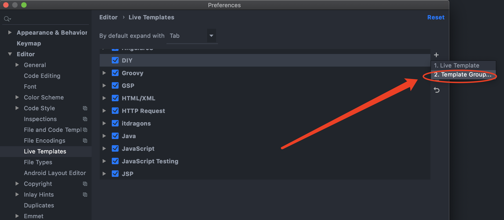
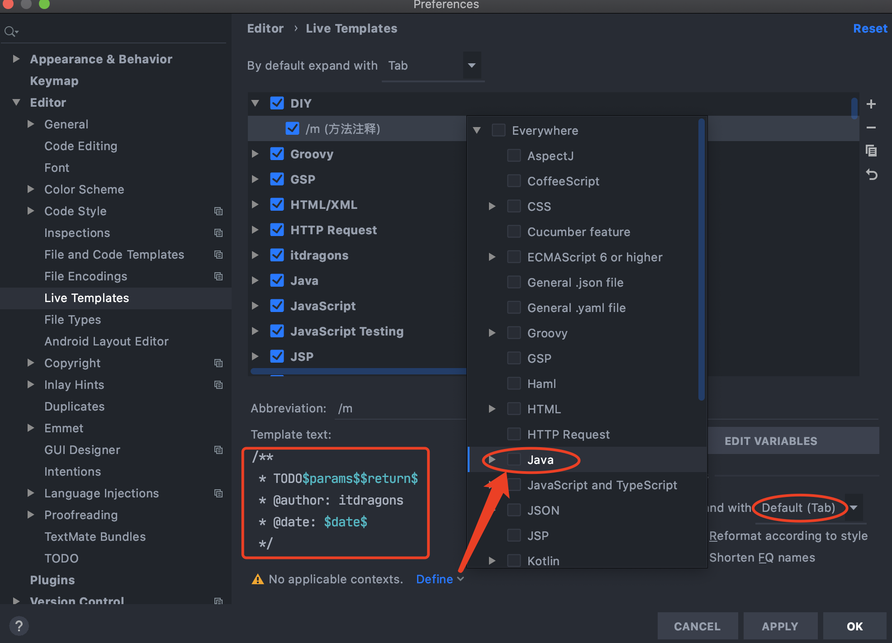
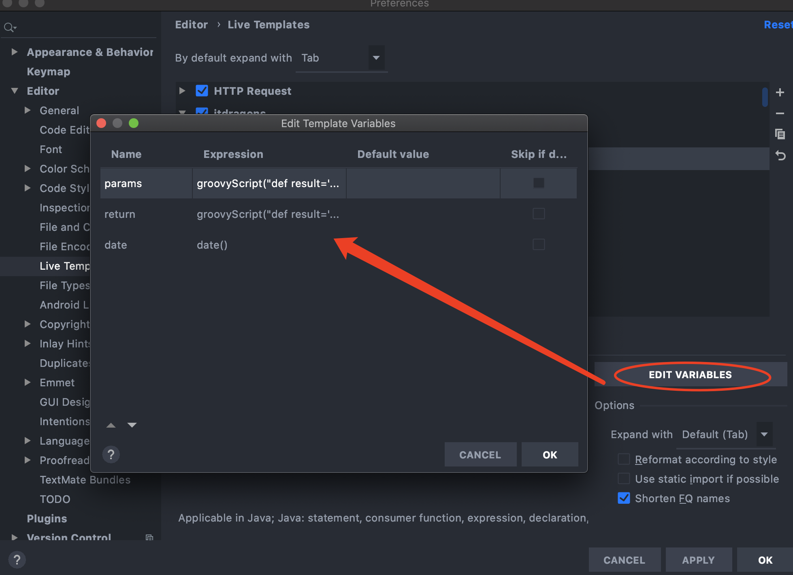
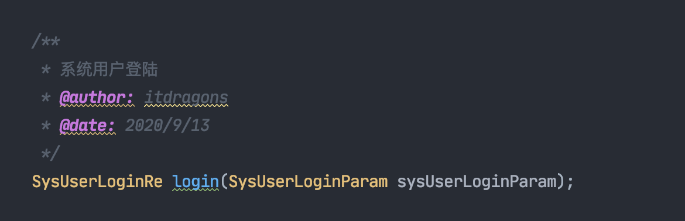
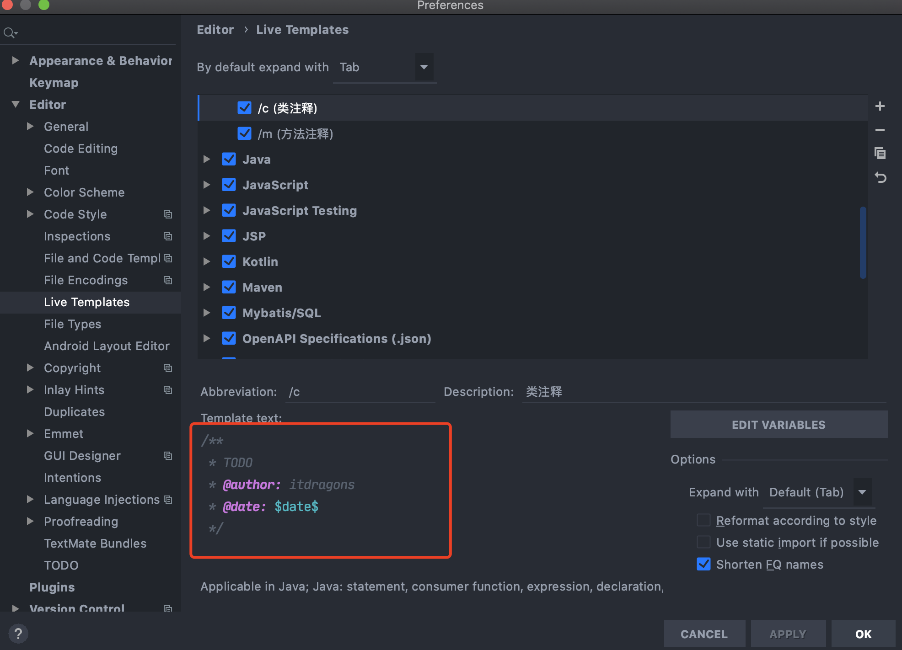
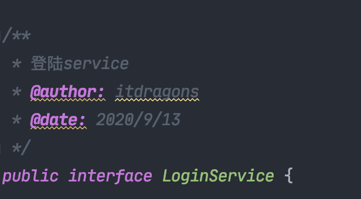

[toc]

# 方法注释

> 打开File->Setting->Editor->LiveTemplates



**点击右边上面那个绿色的+号，选择Template Group双击，然后弹出一个窗口，随便添加一个名字，我这里添加的是DIY然后点击OK**



**还是在File->Setting->Editor->LiveTemplates这个路径下点击一下刚刚你添加的那个名字，然后点击右边上面那个绿色的+号，选择LiveTemplate双击，填写下面的内容到图上的框中**

```
/**
 * TODO$params$$return$
 * @author: 你的名字
 * @date: $date$
 */
```



**最后点击右下角的Edit variables 按钮，然后弹出一个窗口**

> params参数表达式

```
groovyScript("def result=''; def stop=false; def params=\"${_1}\".replaceAll('[\\\\[|\\\\]|\\\\s]', '').split(',').toList(); if (params.size()==1 && (params[0]==null || params[0]=='null' || params[0]=='')) { stop=true; }; if(!stop) { for(i=0; i < params.size(); i++) {result +=((i==0) ? '\\r\\n' : '') + ((i < params.size() - 1) ? ' * @param: ' + params[i] + '\\r\\n' : ' * @param: ' + params[i] + '')}; }; return result;", methodParameters())
```

> return参数表达式

```
groovyScript("def result=''; def data=\"${_1}\"; def stop=false; if(data==null || data=='null' || data=='' || data=='void' ) { stop=true; }; if(!stop) { result += '\\r\\n' + ' * @return: ' + data; }; return result;", methodReturnType())
```

**在方法前输入 `/` `m` `tab`即可自动生成注释**



# 类注释



设置方式同`方法注释`

> Template text

```
/**
 * TODO
 * @author: 你的名字
 * @date: $date$
 */
```

**在类名前输入 `/` `c` `tab`即可自动生成注释**

