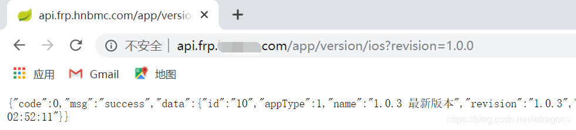

场景：后端和前端在AB两座不同的城市，希望可以在一个网段内本地联调。
最终实现：可以通过域名请求我本机启动的服务，达到远程调试的目的。
前置条件：一台有公网的服务器即可

准备工具frp: 一款强大的内网穿透工具->[项目地址](https://github.com/fatedier/frp/blob/master/README_zh.md)

 1. 域名解析配置

 2. nginx配置（80端口一般被nginx使用，如果不做域名访问，可以跳过）
> server{
> listen 80;
> server_name *.frp.xxxxx.com;
> location / {
> 	proxy_pass http://localhost:7090;
> 	proxy_set_header Host $host;
> }
> }

 3. frp服务端配置
> [common]
> bind_port = 7000 
> #由于80端口已占用，这里使用Nginx做端口映射到此端口
> vhost_http_port = 7090 
> #连接池
> max_pool_count = 5
> #token验证
> token = 2312321
> #自定义二级域名
> subdomain_host = frp.xxxxx.com
> #控制面板
> dashboard_port = 7099
> dashboard_user = admin
> dashboard_pwd = 2312321
> #日志
> log_file = ./frps.log
> log_level = info
> log_max_days = 3

 4. frp客户端配置
> [common]
> #服务器IP
> server_addr = 47.xx.xx.xx9
> #服务器bind_port
> server_port = 7000 
> #连接密钥
> token = 2312321
> #日志
> log_file = ./frpc.log
> log_level = info
> log_max_days = 3
> #域名访问本地端口
> [http_api_dev]
> type = http
> local_ip = 127.0.0.1
> local_port = 18081
> subdomain = api #子域名即：api.frp.xxxxx.com
> #端口访问本地端口
> [http_api_dev]
> type = http
> local_ip = 127.0.0.1
> local_port = 18081
> remote_port = 18081 #这里填写服务器的端口，选一个没有被占用的即可
> #如果不使用SSH可以将其注释掉
> [tcp_ssh]
> type = tcp
> local_ip = 127.0.0.1
> local_port = 22
> remote_port = 7101

5.通过域名访问接口服务
